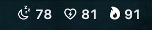
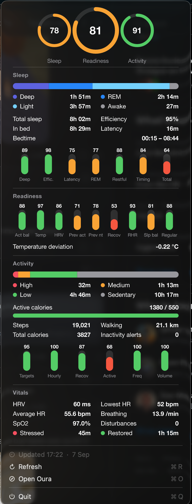

# Oura Bar

Your Oura Ring scores in the macOS menu bar, with a full stats card one click away.





Sleep, readiness, and activity scores sit in the menu bar with icons that fill in as the score improves. The dropdown shows score rings, sleep stages, contributors, activity breakdown, HRV, heart rate, breathing, SpO2, and stress. It refreshes every two minutes and follows the system light/dark theme.

The data fetching and card rendering are TypeScript on [Bun](https://bun.sh) with [Effect](https://effect.website). A ~200 line Swift host draws the status item and menu. No Electron, no third-party menu bar app.

## Requirements

- macOS 13 or later on Apple silicon or Intel
- [Bun](https://bun.sh) 1.1 or later
- Xcode Command Line Tools for `swiftc` (`xcode-select --install`)
- An Oura Ring with an active membership

## Setup

### 1. Register an Oura app

Oura retired personal access tokens in December 2025, so you need your own OAuth app. It takes a minute.

1. Sign in at https://cloud.ouraring.com/oauth/applications
2. Create a new application
3. Set the redirect URI to `http://localhost:8484/callback`
4. Enable the `daily`, `heartrate`, and `spo2` scopes
5. Copy the client id and client secret

### 2. Configure

```sh
git clone https://github.com/charlietlamb/oura-bar.git
cd oura-bar
bun install
cp .env.example .env
```

Paste the client id and secret into `.env`.

### 3. Authorize

```sh
bun run auth
```

This opens Oura's consent screen in your browser, catches the redirect on localhost, and stores tokens in `~/.config/oura/tokens.json` with owner-only permissions. Tokens refresh automatically.

### 4. Build and launch

```sh
bun run start
```

This compiles the host, bundles the runtime into it, installs `~/Applications/Oura Bar.app`, and launches it. The scores appear in the menu bar within a few seconds.

To keep it running after a reboot, add `~/Applications/Oura Bar.app` in System Settings → General → Login Items.

## Commands

| Command | What it does |
| --- | --- |
| `bun run auth` | Authorize with Oura and store tokens |
| `bun run fetch` | Fetch once and print the JSON payload the host consumes |
| `bun run preview` | Render the stats card to `preview.png` |
| `bun run start` | Build, install to `~/Applications`, launch |
| `bun run restart` | Quit the running app, then build, install, launch |
| `bun run validate` | Lint, comment check, typecheck, tests |

## Configuration

Set these in `.env`.

| Variable | Default | Notes |
| --- | --- | --- |
| `OURA_CLIENT_ID` | | required |
| `OURA_CLIENT_SECRET` | | required |
| `OURA_REDIRECT_URI` | `http://localhost:8484/callback` | must match the registered app exactly |
| `OURA_SCOPES` | `daily heartrate spo2` | add `stress` for the resilience row, then run `bun run auth` again |
| `OURA_REFRESH_INTERVAL` | `2 minutes` | poll interval, baked into the app at build time |

Oura only publishes new data when the ring syncs to your phone, so polling more often than every couple of minutes gains nothing.

## How it works

1. The host app runs `bun run src/cli/fetch.ts` from its bundled runtime on launch, on Refresh, and on the interval, passing `OS_APPEARANCE` and a temp file path.
2. `fetch` pulls the last three days of readiness, sleep, activity, sleep periods, SpO2, stress, and resilience in parallel, picks the latest day, builds the card as SVG, rasterises it at 2x with [resvg](https://github.com/RazrFalcon/resvg) using your system fonts, and writes one JSON payload.
3. The host reads the payload, sets the attributed title with SF Symbols, and puts the card in the menu as an image view. A 144 DPI tag on the PNG keeps it sharp on retina displays.

The runtime is bundled into the app and installed under `~/Applications` on purpose. When an unsigned app spawns a process inside `~/Documents`, macOS pauses it on a privacy prompt, and bun would hang inside `getcwd()` until you answered.

## Project layout

```
host/
  main.swift             entry point
  MenuController.swift   status item, menu, fetch subprocess
  StatusTitle.swift      attributed title with tinted SF Symbols
src/
  config.ts              configuration from environment
  schema/                Effect Schema for tokens, callback params, Oura collections
  auth/                  token store, OAuth client, loopback callback server, auth service
  api/oura-api.ts        typed collection fetch with bearer auth and retry
  stats/                 latest-day selection and the stats service
  card/                  SVG card: theme, primitives, layout blocks, rings, sections, PNG
  menubar/               payload contract, title, formatting
  layers/live.ts         composition root
  cli/                   auth, fetch, preview, build-host, install-app
tests/                   pure unit tests
```

## Troubleshooting

- **Menu says Loading forever.** Check `~/Library/Logs/OuraBar.log`. Run `bun run fetch` in the project to see the error directly.
- **Authorization fails with an invalid redirect.** The redirect URI in Oura's app settings must be exactly `http://localhost:8484/callback`.
- **Resilience row missing.** Oura requires the `stress` scope for `daily_resilience`. Add it to the app in Oura's developer portal and to `OURA_SCOPES`, then re-run `bun run auth`.
- **Not authenticated after a while.** Refresh tokens are single use. Running two copies of the app at once will invalidate one of them. Run `bun run auth` again.
- **Verifying the menu from a script.** `pkill -USR1 -x OuraBar` toggles the menu open and closed, which is handy with `screencapture`.

## License

MIT
